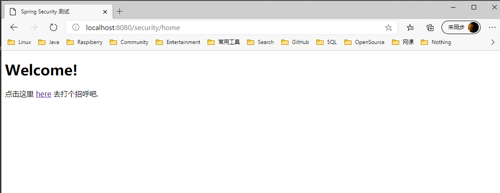
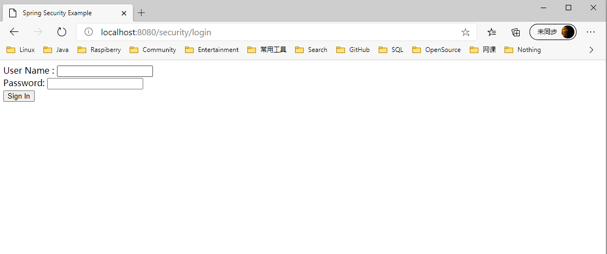
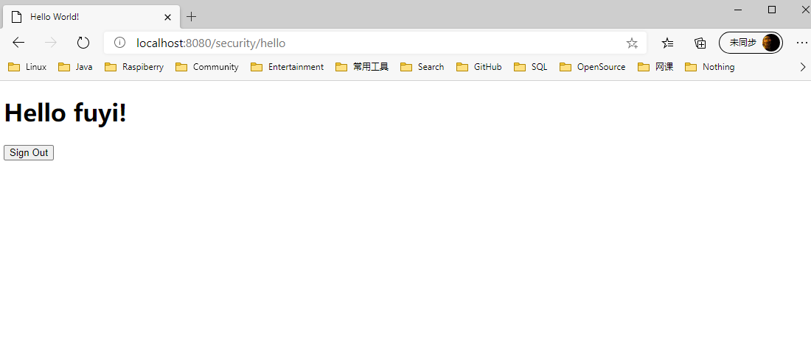

# spring-security

#### 1. 环境的搭建

   - 1.1 添加pom.xml依赖
   
   ```xml
<?xml version="1.0" encoding="UTF-8"?>
<project xmlns="http://maven.apache.org/POM/4.0.0" xmlns:xsi="http://www.w3.org/2001/XMLSchema-instance"
         xsi:schemaLocation="http://maven.apache.org/POM/4.0.0 https://maven.apache.org/xsd/maven-4.0.0.xsd">
    <modelVersion>4.0.0</modelVersion>
    <parent>
        <groupId>org.springframework.boot</groupId>
        <artifactId>spring-boot-starter-parent</artifactId>
        <version>2.3.3.RELEASE</version>
        <relativePath/> <!-- lookup parent from repository -->
    </parent>

    <groupId>com.ryan</groupId>
    <artifactId>spring-security</artifactId>
    <version>0.0.1-SNAPSHOT</version>
    <name>spring-security</name>
    <description>Demo project for Spring Boot</description>

    <properties>
        <java.version>1.8</java.version>
    </properties>

    <dependencies>
        <dependency>
            <groupId>org.springframework.boot</groupId>
            <artifactId>spring-boot-starter-thymeleaf</artifactId>
        </dependency>
        <dependency>
            <groupId>org.springframework.boot</groupId>
            <artifactId>spring-boot-starter-web</artifactId>
        </dependency>

        <dependency>
            <groupId>org.springframework.boot</groupId>
            <artifactId>spring-boot-starter-test</artifactId>
            <scope>test</scope>
            <exclusions>
                <exclusion>
                    <groupId>org.junit.vintage</groupId>
                    <artifactId>junit-vintage-engine</artifactId>
                </exclusion>
            </exclusions>
        </dependency>

        <!--security依赖-->
        <dependency>
            <groupId>org.springframework.boot</groupId>
            <artifactId>spring-boot-starter-security</artifactId>
        </dependency>

        <!--        配置Mysql依赖-->
        <dependency>
            <groupId>mysql</groupId>
            <artifactId>mysql-connector-java</artifactId>
            <version>5.1.49</version>
            <scope>runtime</scope>
        </dependency>

        <!--        配置lombok依赖-->
        <dependency>
            <groupId>org.projectlombok</groupId>
            <artifactId>lombok</artifactId>
            <optional>true</optional>
        </dependency>

        <!--        配置Mybatis-plus依赖-->
        <dependency>
            <groupId>com.baomidou</groupId>
            <artifactId>mybatis-plus-boot-starter</artifactId>
            <version>3.4.0</version>
        </dependency>

    </dependencies>

    <build>
        <plugins>
            <plugin>
                <groupId>org.springframework.boot</groupId>
                <artifactId>spring-boot-maven-plugin</artifactId>
            </plugin>
        </plugins>
    </build>

</project>

   ```
   
   Spring Boot提供了一个spring-boot-starter-security启动程序，它将Spring Security相关的依赖项聚合在一起。
   
   - 1.2 Java配置
   
   ```java
    package com.ryan.springsecurity.config;
    
    import org.springframework.context.annotation.Bean;
    import org.springframework.context.annotation.Configuration;
    import org.springframework.security.authentication.AuthenticationManager;
    import org.springframework.security.config.annotation.authentication.builders.AuthenticationManagerBuilder;
    import org.springframework.security.config.annotation.web.builders.HttpSecurity;
    import org.springframework.security.config.annotation.web.configuration.EnableWebSecurity;
    import org.springframework.security.config.annotation.web.configuration.WebSecurityConfigurerAdapter;
    import org.springframework.security.core.userdetails.User;
    import org.springframework.security.core.userdetails.UserDetails;
    import org.springframework.security.core.userdetails.UserDetailsService;
    import org.springframework.security.crypto.bcrypt.BCryptPasswordEncoder;
    import org.springframework.security.provisioning.InMemoryUserDetailsManager;
    
    @EnableWebSecurity
    @Configuration
    public class WebSecurityConfig extends WebSecurityConfigurerAdapter {
        @Override
        protected void configure(HttpSecurity http) throws Exception {
            http
                    .authorizeRequests()
                    .antMatchers( "/security/home")
                    .permitAll()
                    .antMatchers("/security/hello").hasRole("USER")
                    .anyRequest().authenticated()
                    .and()
                    .formLogin()
                    .loginPage("/security/login")
                    .permitAll()
                    .and()
                    .logout()
                    .logoutSuccessUrl("/security/login")
                    .permitAll();
        }
    
    //    @Bean
    //    @Override
    //    public UserDetailsService userDetailsService() {
    //        UserDetails user =
    //                User.withDefaultPasswordEncoder()
    //                        .username("user")
    //                        .password("password")
    //                        .roles("USER")
    //                        .build();
    //
    //        return new InMemoryUserDetailsManager(user);
    //    }
    
        @Override
        protected void configure(AuthenticationManagerBuilder auth) throws Exception {
            auth.inMemoryAuthentication().passwordEncoder(new BCryptPasswordEncoder())
                    .withUser("fuyi").password(new BCryptPasswordEncoder().encode("123456")).roles("USER");
        }
    }

   ```

   - 1.3 路由策略
   
   ```java
    @Controller
    @RequestMapping("/security")
    public class RouteController {
    
        @GetMapping("home")
        public String home() {
            return "home";
        }
    
        @GetMapping("login")
        public String login() {
            return "login";
        }
    
        @GetMapping("hello")
        public String hello() {
            return "hello";
        }
    
    
    
    }       
   ```

   - 1.4 静态文件
   
   hello.html
   
   ```html
    <!DOCTYPE html>
    <html xmlns="http://www.w3.org/1999/xhtml" xmlns:th="https://www.thymeleaf.org"
          xmlns:sec="https://www.thymeleaf.org/thymeleaf-extras-springsecurity3">
    <head>
        <title>Hello World!</title>
    </head>
    <body>
    <h1 th:inline="text">Hello [[${#httpServletRequest.remoteUser}]]!</h1>
    <form th:action="@{/logout}" method="post">
        <input type="submit" value="Sign Out"/>
    </form>
    </body>
    </html>
   ```

   home.html

   ```html
    <!DOCTYPE html>
    <html xmlns="http://www.w3.org/1999/xhtml" xmlns:th="https://www.thymeleaf.org" xmlns:sec="https://www.thymeleaf.org/thymeleaf-extras-springsecurity3">
    <head>
        <title>Spring Security 测试</title>
    </head>
    <body>
    <h1>Welcome!</h1>
    
    <p>点击这里 <a th:href="@{/security/hello}">here</a> 去打个招呼吧.</p>
    </body>
    </html>
   ```

   login.html
   
   ```html
    <!DOCTYPE html>
    <html xmlns="http://www.w3.org/1999/xhtml" xmlns:th="https://www.thymeleaf.org"
          xmlns:sec="https://www.thymeleaf.org/thymeleaf-extras-springsecurity3">
    <head>
        <title>Spring Security Example </title>
    </head>
    <body>
    <div th:if="${param.error}">
        Invalid username and password.
    </div>
    <div th:if="${param.logout}">
        You have been logged out.
    </div>
    <form th:action="@{/security/login}" method="post">
        <div><label> User Name : <input type="text" name="username"/> </label></div>
        <div><label> Password: <input type="password" name="password"/> </label></div>
        <div><input type="submit" value="Sign In"/></div>
    </form>
    </body>
    </html>
   ```


#### 2. 测试结果

   - 首页 
   
   
   
   - 登录
   
   
   
   - 授权页面
   
   


#### 3. 连接数据库认证授权


